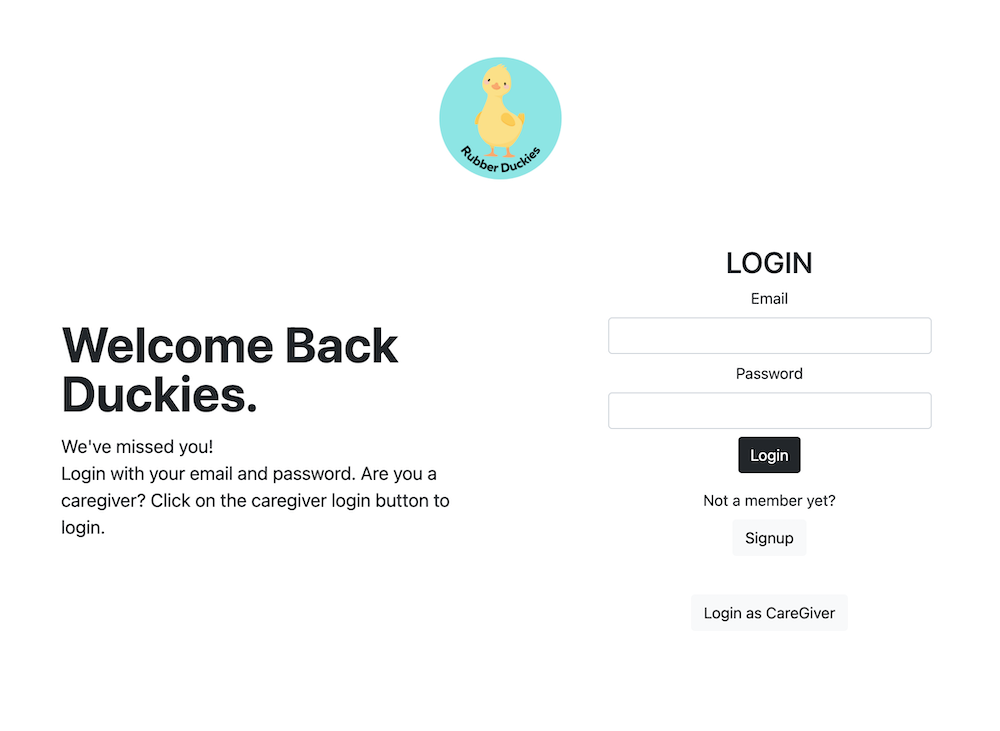
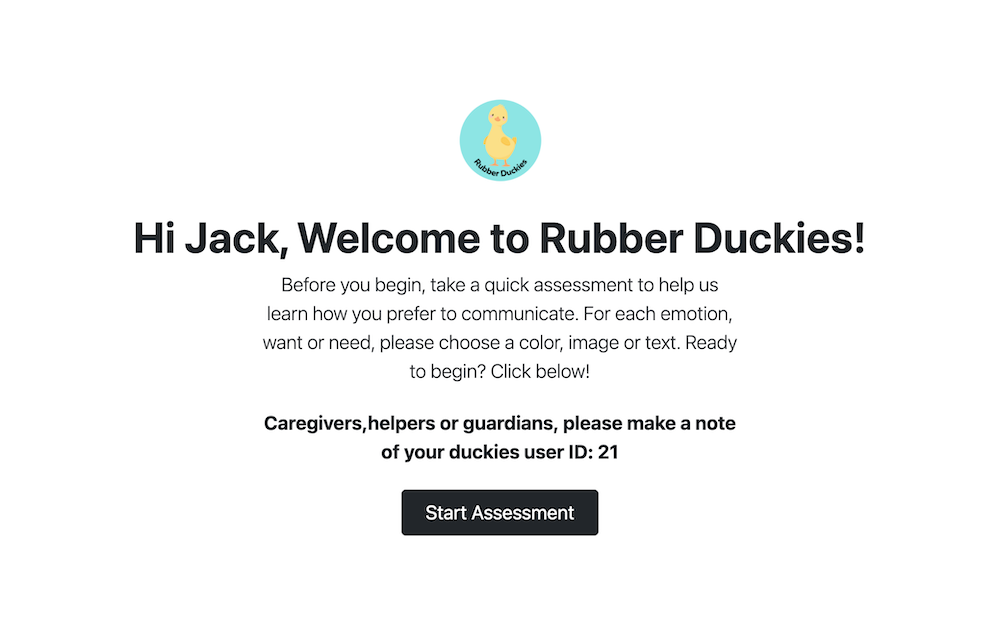
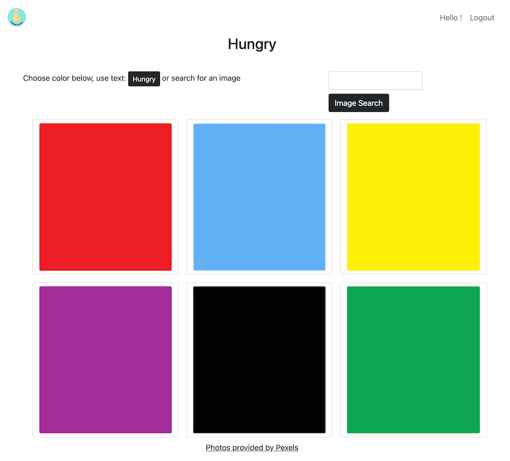
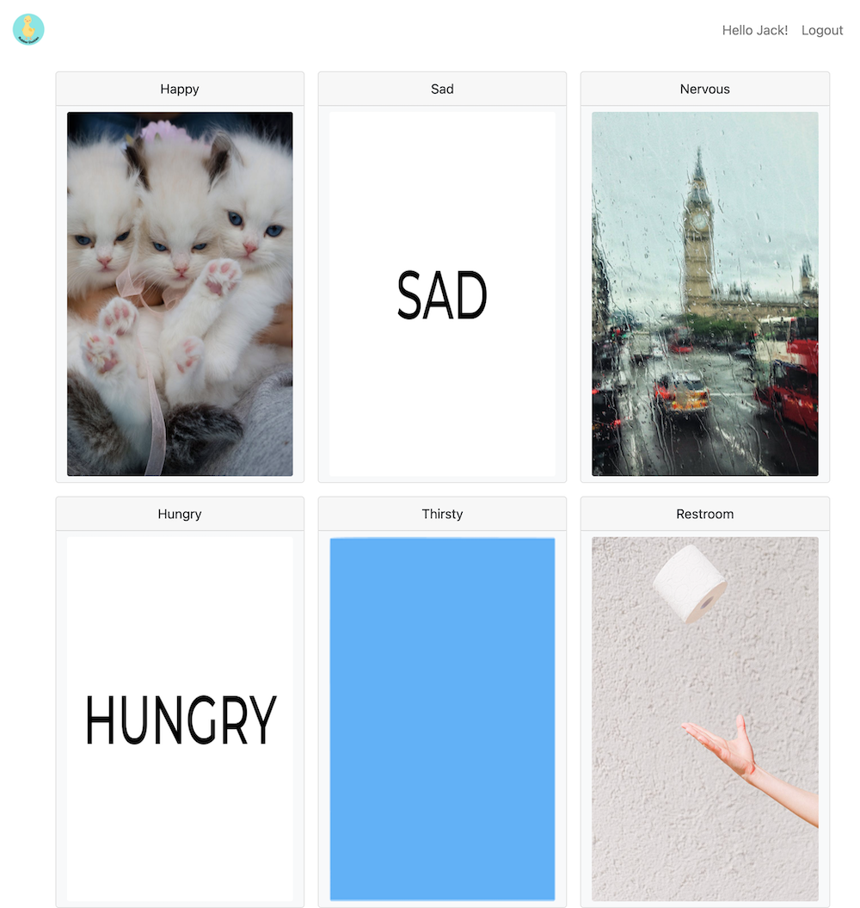
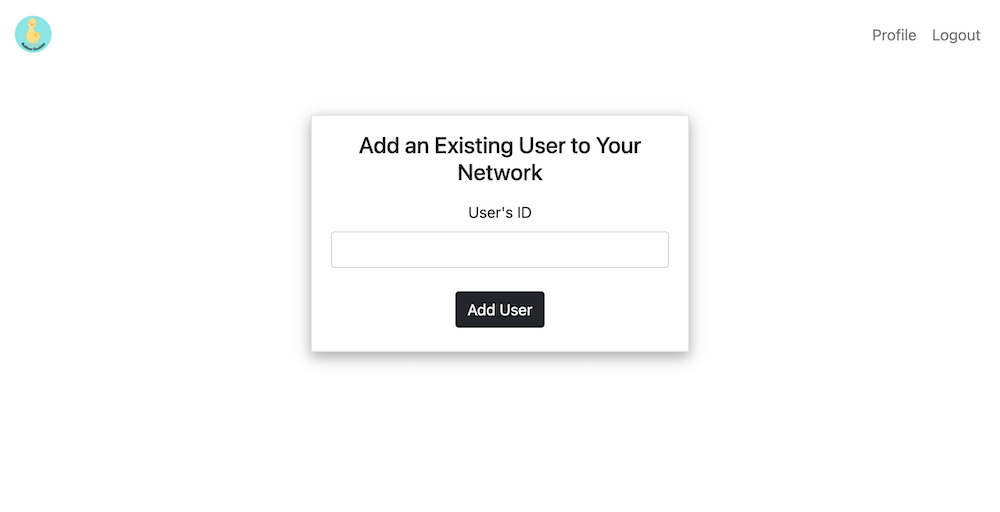
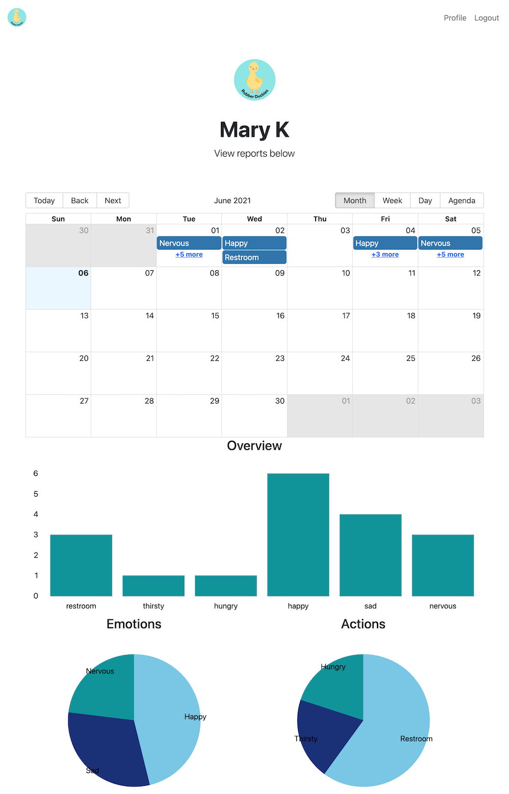

# Rubber Duckies
A full stack REACT app.

## Description
A full stack application built using a MySQL and express backend and REACT frontend. App for facilitating communication for those who might experience difficulty communicating due to learning disabilities, social anxiety, etc. The App contains two user types and user experiences: the user making use of the app to communicate and the caregiver responsible for them.

## User Story

As a USER I should be able to create an account.

When I create an account, I should be presented with options to choose my preferred method of communicating a given emotion or need.

When I have made my choices, I should be presented with a homepage that shows my choices.

When I need to communicate an emotion or need, I should be able to click on the relevant emotion/need on my homepage.

When I click on the emotion/need, a popup should show the chosen emotion/need so I can show those around me to communicate better.

The emotion/need clicked on should also be saved to my account with a timestamp so my caregiver can view this information and be able to help me.

As a CAREGIVER I should be able to create an account.

When I create an account or login, I should see my profile page with all the users I care for displayed.

If I want to add a user to my profile, I should be able to click on an 'add user' button and add a user by their ID.

When I click on a user on my profile page, I should be able to see all the needs and emotions the user has clicked on displayed in easy-to-read charts and calendars. 

## Table of Contents

* [Installation](#installation)
* [Usage](#usage)
* [Contributing Guidelines](#contributing)
* [License](#license)
* [Questions](#questions)

## Installation

This application was created using the React, express and MySQL. The deployed app can be found [here](https://damp-shelf-60845.herokuapp.com/).

The deployed app offers the best user experience, but for running the app locally, download the repo, run 'npm install' in the root folder and then 'npm start' to start the development  server. App will be found at localhost:3000 if run locally.

## Usage

When the user navigates to the app, they will be presented with a login page. Existing  users can login here, existing caregivers  can click on 'login as caregiver' button to login in or new users/caregivers can click on sign up button to create an account.

USERS:

When a user signs up for the first time, they will be presented with an assessment where they will choose what color, image or word they would like to assign to each of the given emotions/needs. 

Once the user has made their choices, they will be taken to their homepage where they will be presented with all the emotions and needs options (hungry, thirsty, restroom, happy, sad and nervous). 

When a user needs to communicate with their Caregiver or with those around them, they can click on the relevant emotion/need and a popup will show up on screen for the user to show those around them and their choice will also be saved to their account for the caregiver to see.
Once a user is signed up for their account, subsequent logins will take them directly to their homepage for an easy and uncomplicated user experience.

CARGIVERS:

When a caregiver signs up for the first time, they will be taken to their profile page where they will be prompted to add users to their account. They can add users by the user's id (as caregivers are expected to help the users setup their accounts, they will be aware of the user's id). 

Once users have been added, the caregiver will see all their chosen users on their profile page. Clicking on any user card will direct the caregiver to that user's details page where they will be able to see the emotions and needs the user clicked on and when they did so. This data will be displayed in a calendar with timestamps, in pie charts as well as bar charts for easy parsing. 

## Contributing

 

 Link to Contributor's Covenant:[Contributors Covenant](https://www.contributor-covenant.org/version/2/0/code_of_conduct/) 

 
## License

   
Copyright (c) [2021] [Nida Ghuman] [Morgan Bailey] [Israel Molestine] [Bhavika Patel]

Permission is hereby granted, free of charge, to any person obtaining a copy
of this software and associated documentation files (the "Software"), to deal
in the Software without restriction, including without limitation the rights
to use, copy, modify, merge, publish, distribute, sublicense, and/or sell
copies of the Software, and to permit persons to whom the Software is
furnished to do so, subject to the following conditions:

The above copyright notice and this permission notice shall be included in all
copies or substantial portions of the Software.

THE SOFTWARE IS PROVIDED "AS IS", WITHOUT WARRANTY OF ANY KIND, EXPRESS OR
IMPLIED, INCLUDING BUT NOT LIMITED TO THE WARRANTIES OF MERCHANTABILITY,
FITNESS FOR A PARTICULAR PURPOSE AND NONINFRINGEMENT. IN NO EVENT SHALL THE
AUTHORS OR COPYRIGHT HOLDERS BE LIABLE FOR ANY CLAIM, DAMAGES OR OTHER
LIABILITY, WHETHER IN AN ACTION OF CONTRACT, TORT OR OTHERWISE, ARISING FROM,
OUT OF OR IN CONNECTION WITH THE SOFTWARE OR THE USE OR OTHER DEALINGS IN THE
SOFTWARE. 

## Questions

The repo for this project can be found here: https://github.com/morgan-b/rubber-duckies

Deployed project can be found at: https://damp-shelf-60845.herokuapp.com/

Find us at github: 

[Morgan Bailey](https://github.com/morgan-b)

[Nida Ghuman](https://github.com/nidaqg)

[Israel Molestina](https://github.com/Israel-Molestina)

[Bhavika Patel](https://github.com/Bhavipatel21)

